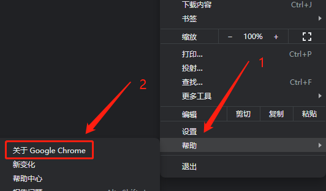
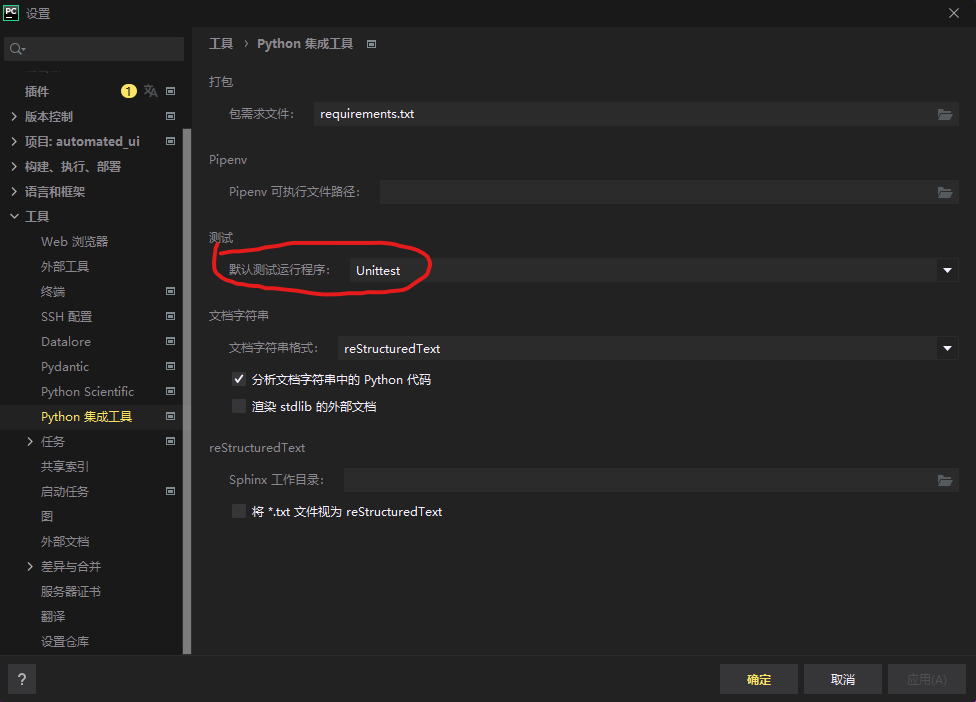
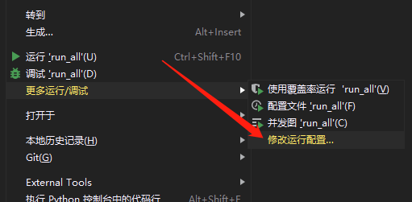
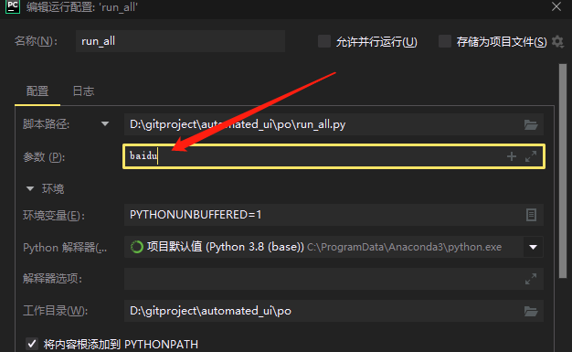
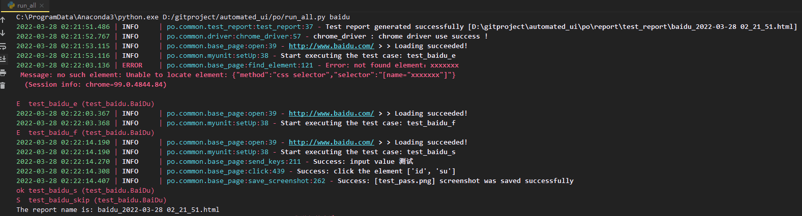
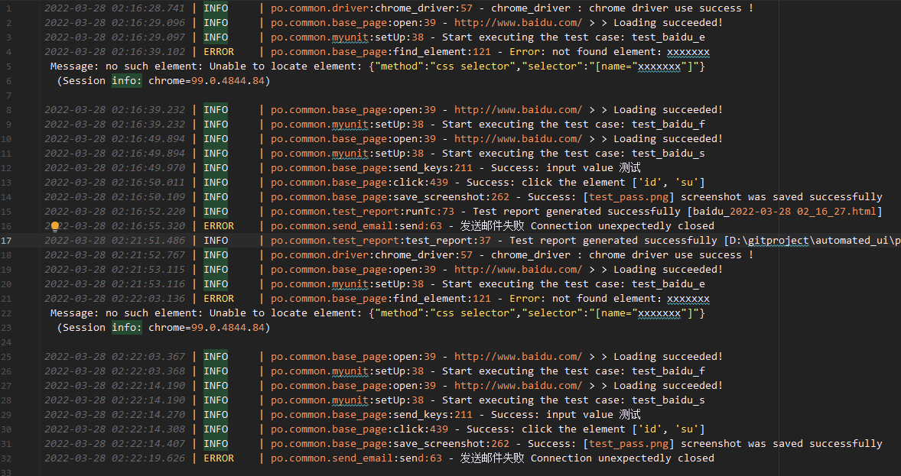
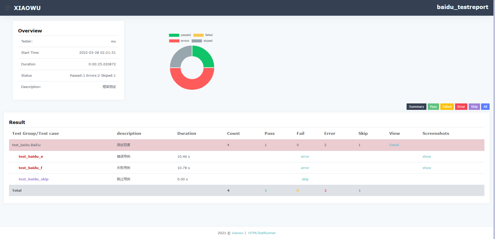
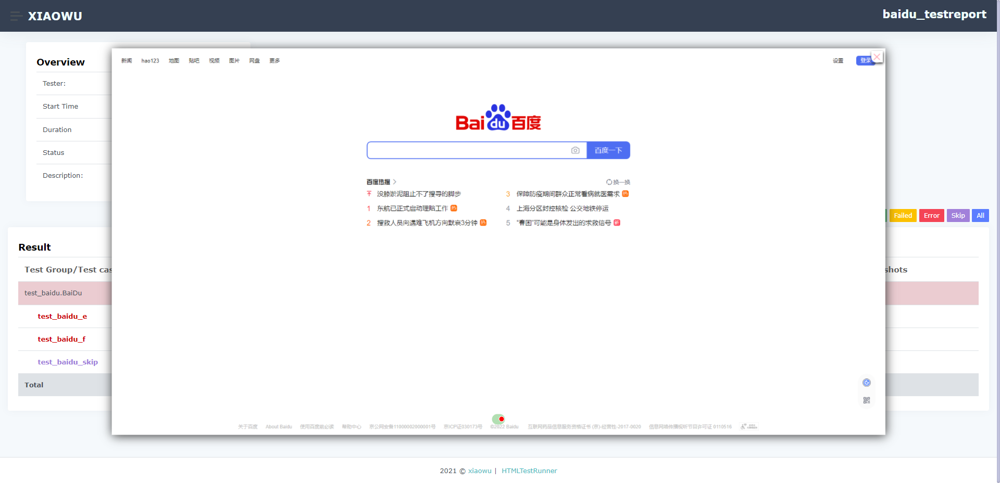
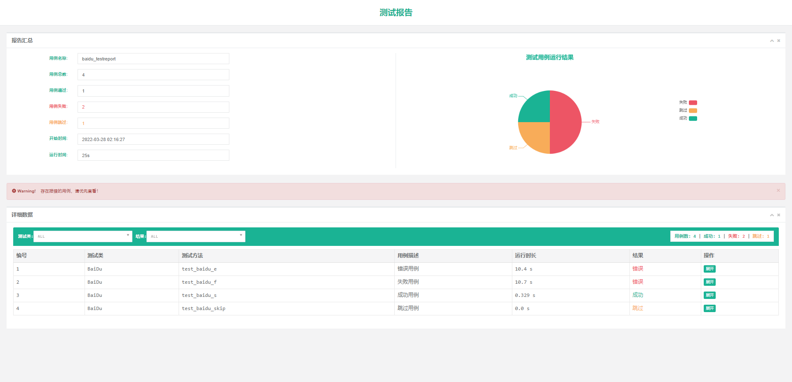

# unittest UI自动化测试

## 📋 功能概述
* 采用PO模式编写
* 对webdriver常用方法二次封装，并增加日志记录
* 支持测试完成后，自动发送邮件
* 支持chrome，Firefox，IE浏览器
* 数据库 mysql 线程池
* 可使用 excel，yaml 规整定位元素
* 封装 unittest 运行方式
* beautifulreport 或 HtmlTestrunner 测试报告

## 🌴 项目结构介绍
```
automated_unittest
    |
    ├─ po
    │   │
    │   ├─ common
    │   │    | base_page        封装常用的元素定位方法
    │   │    │ doexcel.py       excel文件读取
    │   |    | doyaml.py        yaml文件读写
    │   │    │ driver.py        封装实例化所有浏览器驱动
    │   │    │ log.py           生成记录日志
    │   │    │ send_mail.py     发送邮件
    │   │    │ myunit.py        封装单元测试依赖
    │   │    │ test_report.py   封装测试报告方法
    │   │
    │   ├─ core
    │   │    ├─ config.yaml     配置文件
    |   |    ├─ get_conf.py     读取配置
    │   │    └─ path_conf.py    相关路径配置
    │   │
    │   ├─ data                 
    │   │   └─test_data         
    │   |        ├─ *.yaml      存放测试元素数据
    │   │        └─ *.xlsx      存放测试元素数据
    │   │ 
    │   ├─ packages              
    │   |    | TestRunner       测试报告(HTML)
    │   | 
    │   ├─ report               
    │   │    ├─ image           截图存放目录
    │   |    |    ├─ fail       失败截图
    │   |    |    └─ pass       成功截图
    │   │    ├─ log             log日志
    │   │    └─ test_report     测试报告
    │   │
    │   ├─ testcase             
    │   │    └─ *               测试项目目录
    │   │       ├─ *_page       测试用例类涉及的元素或通用操作封装
    │   |       └─ test_*.py    测试用例
    │   |
    │   ├─ utils                 
    │   |    |  file_operations.py  文件上传
    │   |    └─ key_board.py    键盘操作
    │   |
    │   ├─ run_all.py           运行全部用例
    │   ├─ run_class.py         运行单个类文件所有用例
    │   ├─ run_function.py      运行单个方法用例
    |
    └─ requirements.txt         依赖包
```

## 👨‍💻 环境准备

谷歌驱动为例:

1. 进入谷歌浏览器,点击右上角的三个点,查看谷歌浏览器版本



2. 下载谷歌浏览器对应版本号的驱动 ➡ [chromedriver](http://npm.taobao.org/mirrors/chromedriver/)


3. 将下载的驱动解压,放到"安装python的根目录"


## 🚀 运行方法

### 安装依赖
```shell
pip install -r requirements.txt
```

### 命令行运行:
```text
1: 进入 po/ 目录下
2: 命令行参数配置: python 运行文件 测试用例目录名
   for demo:
       python run_all.py baidu  # 执行全部用例类的全部用例函数
       python run_class.py baidu  # 执行指定用例类
       python run_function.py baidu  # 执行指定类中的指定函数
```

### pycahrm运行:

1. 指定测试运行程序为: Unittest



2. 运行文件鼠标右键,选择如图所示



3. 配置参数: 测试用例目录名




## 🖼️ 效果图

pycharm控制台:


日志效果：


HTML 测试报告（可在 packages/TestRunner 目录下自行修改样式等...）


自动截取错误截图


BeautifulReport 测试报告（原生第三方）

