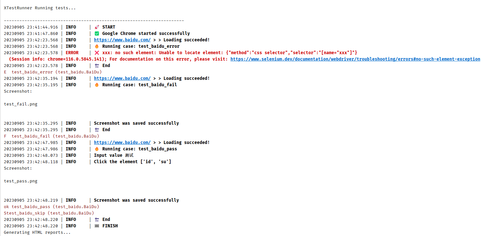
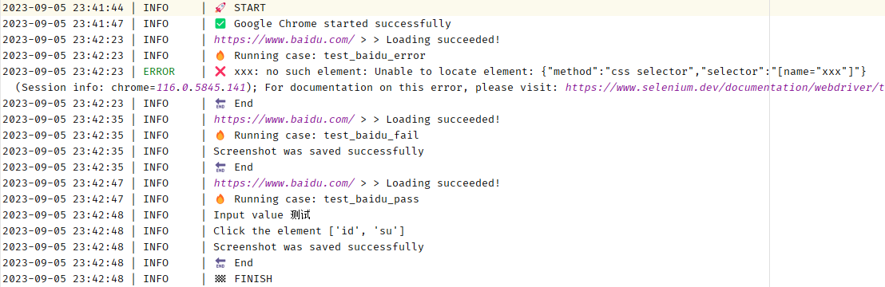
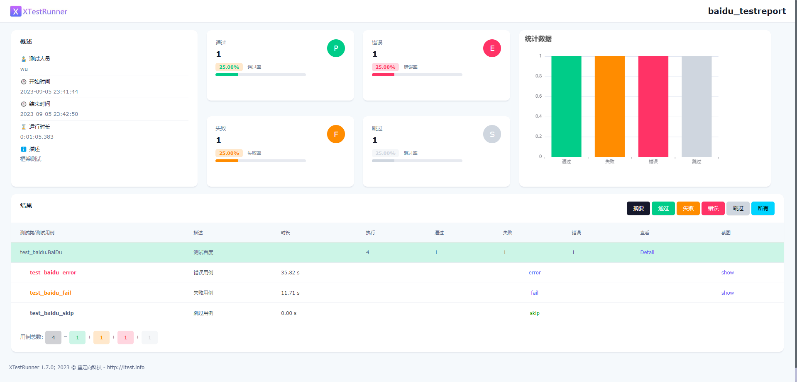
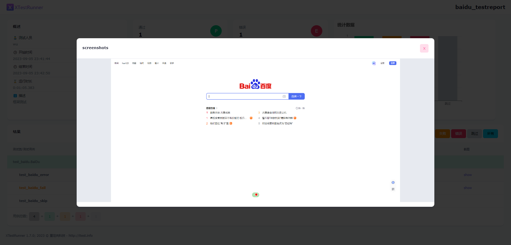
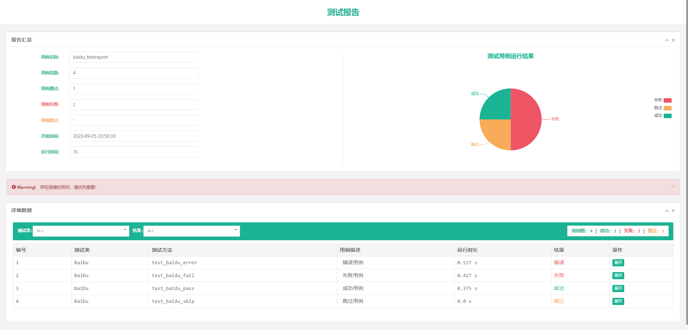

# unittest UI自动化测试

## 📋 功能概述

* PO模式架构
* webdriver封装
* 发送邮件测试报告
* 支持Chrome, Edge, Firefox浏览器
* 浏览器驱动自动下载安装
* 支持 mysql 数据库
* 使用 excel, yaml 归纳定位元素
* 封装 unittest 运行
* BeautifulReport / HtmlTestrunner 测试报告

## 🌴 项目结构介绍

```
automated_ui
    |
    ├─ po
    │   │
    │   ├─ common
    │   │    | base_page        封装常用的元素定位方法
    │   │    │ do_excel.py      excel文件读取
    │   |    | do_yaml.py       yaml文件读写
    │   │    │ driver.py        封装实例化所有浏览器驱动
    │   │    │ log.py           生成记录日志
    │   │    │ send_mail.py     发送邮件
    │   │    │ myunit.py        封装单元测试依赖
    │   │    │ html_report.py   封装测试报告方法
    │   │
    │   ├─ core
    │   │    ├─ config.yaml     配置文件
    |   |    ├─ get_conf.py     读取配置
    │   │    └─ path_conf.py    相关路径配置
    │   │
    │   ├─ data                 
    │   │   └─test_data         
    │   |        ├─ *.yaml      存放测试元素数据
    │   │        └─ *.xlsx      存放测试元素数据
    │   │ 
    │   ├─ log                  日志
    │   | 
    │   ├─ report               
    │   │    ├─ image           截图存放目录
    │   |    |    ├─ fail       失败截图
    │   |    |    └─ pass       成功截图
    │   │    └─ html_report     HTML测试报告
    │   │
    │   ├─ testcase             
    │   │    └─ *               测试项目目录
    │   │       ├─ *_page       测试用例页
    │   |       └─ test_*.py    测试用例
    │   |
    │   ├─ utils                工具包
    │   |
    │   ├─ run_all.py           运行全部用例
    │   ├─ run_class.py         运行类文件所有用例
    │   └─ run_function.py      运行方法用例
    |
    └─ requirements.txt         依赖包
```

## 👨‍💻 环境准备

~~手动安装浏览器驱动~~

支持浏览器驱动自动安装

## 🚀 运行

### 安装依赖

```shell
pip install -r requirements.txt
```

### 指定测试项目

test_case 目录下的一级目录为项目目录, 在 conf.yaml 文件中指定 project 为一级目录的文件夹名即可

### 测试数据存放

test_data 目录下的一级目录需要与测试项目匹配

### 运行文件:

```text
run_all.py 运行项目下所有的用例并生成html测试报告

run_class.py 运行项目下指定测试类

run_thead.py 多线程运行项目下所有测试用例
```

### pycharm 运行:

在指定文件右键运行即可

## 🖼️ 效果图

**pycharm 控制台:**



**日志效果:**



**HTML 测试报告**



**自动截取错误截图**



**BeautifulReport 测试报告**


